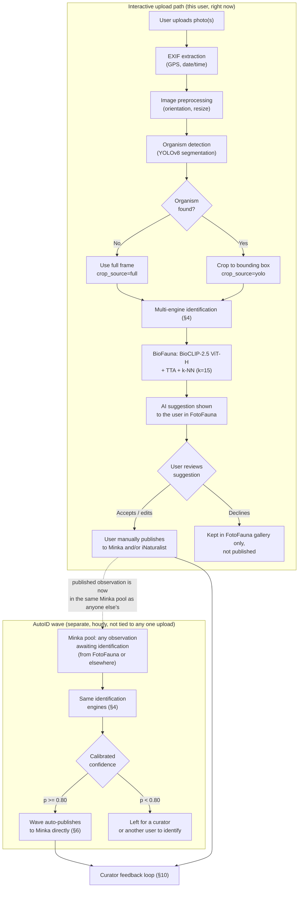
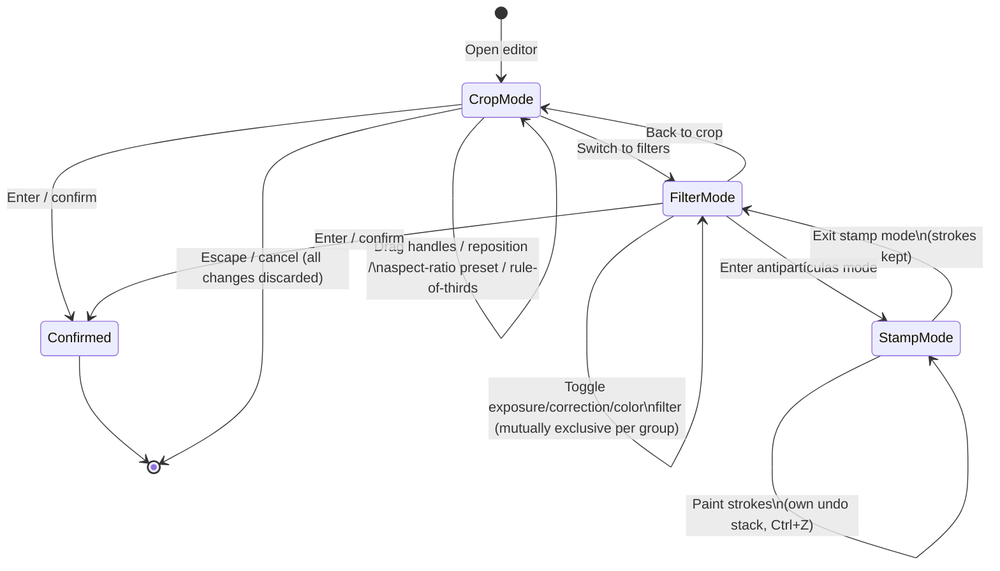
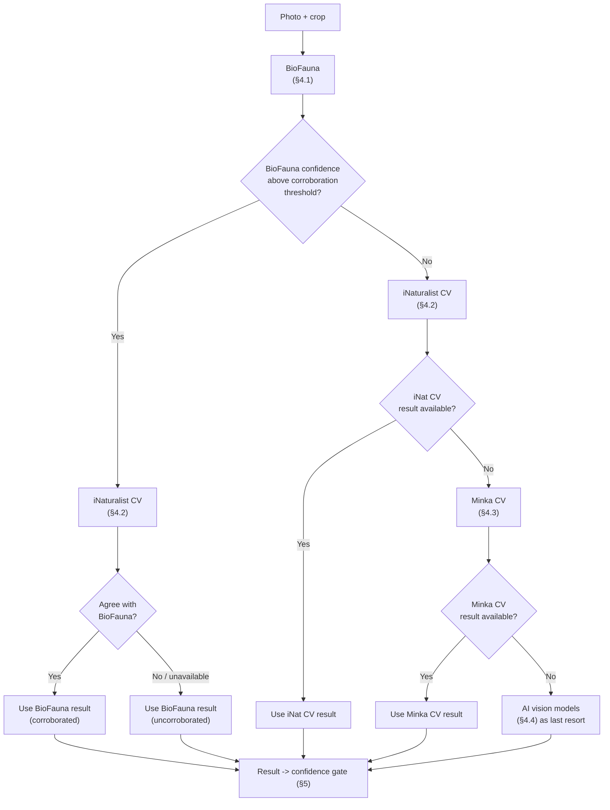
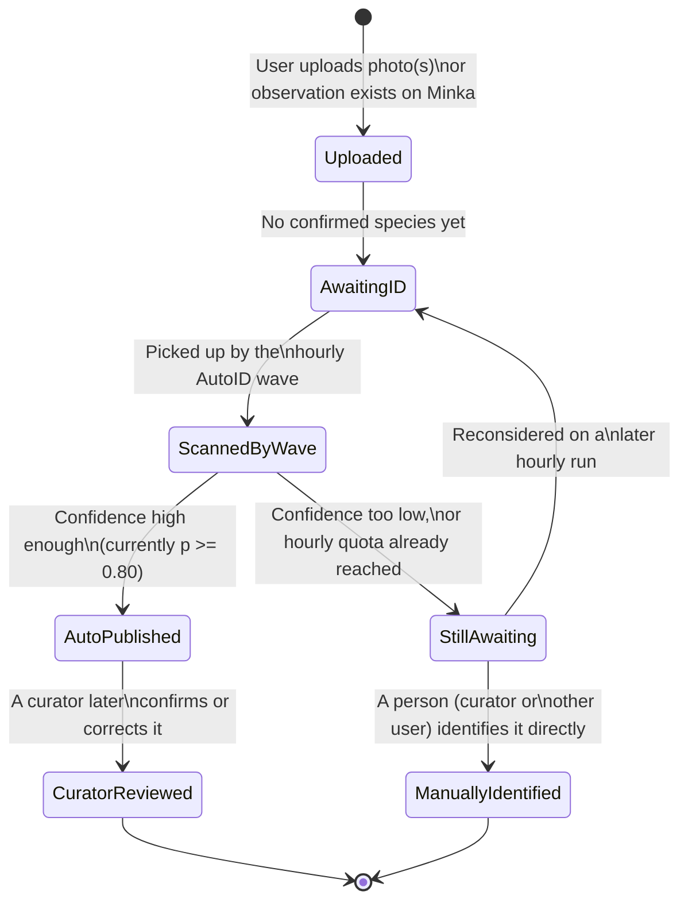
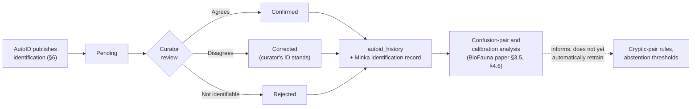

# FotoFauna: A Citizen Science Platform for AI-Assisted Mediterranean Marine Species Identification

**Authors**: Gustavo Zafra (Yespi)
**Repository**: https://github.com/yespi/fotofauna
**Live**: https://fotofauna.yespi.es

## Abstract

> **Editorial note (2026-09-23):** the calibration figures in §5.2 (n=12,788, 2026-08-27) are
> historical. On 2026-09-23 the companion BioFauna project found that half of its evaluation rows
> were copies of gallery photos (BioFauna paper, O18); after removing them the identifier scores
> **88.11%** species out-of-sample (n=12,373) and ~80% on recent research-grade observations. The
> calibrator refit on that leak-free set gives **97.0% precision at 80.6% coverage** at the p≥0.80
> AutoID threshold (species-disjoint split, closed-set). Live gallery: 1,072,233 embeddings /
> 4,705 species, k-NN vote capped at 3 per species. AutoID throughput is configured from the
> FotoFauna admin (currently 30/h and 1,000/day): reaching the hourly cap pauses publication until
> the next hour instead of tripping the circuit breaker; only quality alerts (low confidence, one
> user flooding, album spam) still stop it. Live snapshot: `docs/STATUS.md` in the BioFauna repo.

FotoFauna is a web-based citizen science platform that integrates automated AI species identification with community validation for Mediterranean marine fauna. The platform combines a region-specific AI engine (**BioFauna** — see the companion [BioFauna paper](https://github.com/yespi/biofauna) for full model methodology), currently a **frozen BioCLIP-2.5 ViT-H** retrieval system with test-time augmentation over 1,072,233 reference embeddings across 4,705 species and hierarchical taxonomic abstention, with a multi-engine identification pipeline, organism detection via YOLOv8 segmentation, and automated publication to the Minka citizen science network. High-confidence identifications (calibrated probability ≥ 0.80) are auto-published with an estimated **97.0% precision** at **80.6% coverage** on the leak-free calibration set (2026-09-23; n=12,373, species-disjoint test split — see the editorial note; §5.2 keeps the August table for history). The platform has processed tens of thousands of observations and serves as both a data collection tool and a testbed for AI-assisted identification workflows. This paper describes the platform architecture, identification pipeline, auto-publication system from the end user's perspective, and the feedback loop between automated and expert-curated identifications; the technical internals of the identification model and the AutoID scheduling engine are covered in depth in the companion BioFauna paper.

## 1. Introduction

### 1.1 The Mediterranean Identification Challenge

The Mediterranean Sea hosts over 17,000 marine species (Coll et al., 2010), yet the number of qualified taxonomists capable of identifying them continues to decline (Hopkins & Freckleton, 2002; Kim & Byrne, 2006). Citizen science platforms like iNaturalist and Minka have partially addressed this gap through community-based identification, but the process remains slow — observations can wait days or weeks for expert attention, and rare species may never be identified.

### 1.2 AI-Assisted Citizen Science

Automated image-based identification offers a complementary approach: providing instant species suggestions that accelerate the identification pipeline. Recent advances in vision-language models, particularly BioCLIP (Stevens et al., 2024), have made a strong, frozen, region-adapted retrieval system practical on consumer hardware (companion BioFauna paper), without requiring the backbone itself to be fine-tuned — an empirical finding of that companion work, not an assumption of this one.

### 1.3 Platform Goals

FotoFauna was developed with three primary goals:

1. **Speed**: Provide instant species identification (<2 seconds) for Mediterranean marine photographs
2. **Accuracy**: Achieve high precision (currently ~95%, §5.2) on auto-published identifications through calibrated confidence thresholds
3. **Feedback**: Create a virtuous cycle where AI identifications are validated by experts, and corrections feed back into model improvement

## 2. Platform Architecture

### 2.1 System Overview

FotoFauna runs on a self-hosted Ubuntu server with the following components:

| Component | Technology | Purpose |
|-----------|-----------|---------|
| Frontend | Vanilla JS SPA + WebP | User interface, photo upload, gallery |
| Backend API | FastAPI (Python) | Business logic, authentication, routing |
| AI Engine | BioFauna (frozen BioCLIP-2.5 ViT-H + k-NN) | Species identification — see [BioFauna paper](https://github.com/yespi/biofauna) |
| Database | PostgreSQL + PostGIS | Observations, users, species catalog |
| Proxy | Nginx | SSL termination, caching, routing |
| GPU | NVIDIA RTX 3060 (12 GB) | AI inference (<1s/image) |
| Container | Docker Compose | Service orchestration |

### 2.1.1 End-to-End Workflow

*Figure 1. Two distinct flows, often confused: (top) a user uploading through FotoFauna gets an AI **suggestion** and always publishes to Minka/iNaturalist manually, themselves — there is no auto-publication in this path. (bottom) the AutoID wave (§6) is a separate, hourly batch process that scans Minka's general pool of unidentified observations — which may include this user's own, once published — and auto-publishes an identification on the observation owner's behalf only when confidence clears the bar. The two share the same identification engines but are triggered differently and happen at different times.*

### 2.2 Authentication

Users authenticate via Google OAuth 2.0 with JWT token sessions. Three access levels:
- **Public**: Browse gallery, view species academy
- **Authenticated**: Upload photos, suggest identifications
- **Admin**: Manage species, configure AutoID, access analytics

### 2.3 External Integrations

| Service | Integration | Purpose |
|---------|------------|---------|
| Minka API | REST | Publish observations, fetch taxonomy |
| iNaturalist API | REST + JWT | Computer vision fallback, taxonomy search |
| GROC/OPK | Data import | Morphological descriptions, species validation |
| WoRMS | API | Taxonomic name validation and synonym resolution |

## 3. Photo Upload and Processing

### 3.1 Upload Interface

The upload system supports:
- Drag-and-drop (desktop)
- File picker dialog
- Clipboard paste (Ctrl+V)
- Multiple simultaneous uploads
- Accepted formats: JPEG, PNG, WebP (max 20 MB)

### 3.2 EXIF Processing

Upon upload, the system extracts:
- GPS coordinates (for geographic priors and mapping)
- Capture date/time (for seasonal context)
- Camera orientation (auto-rotate)
- Camera model and settings (metadata only, not used for identification)

If GPS data is absent, the user can manually place a pin on an interactive Leaflet/OpenStreetMap.

### 3.3 Image Preprocessing

Images undergo a preprocessing pipeline:
1. Convert to RGB colorspace
2. Strip EXIF metadata for privacy
3. Generate WebP thumbnails (200px, 400px, 800px)
4. Compute perceptual hash (pHash) for duplicate detection
5. Store original resolution for archival

### 3.4 Organism Detection (YOLO)

Before identification, the system optionally detects and crops the organism from the photo using YOLOv8-nano segmentation (yolo26n-seg.pt):

**Detection Process:**
- Scans the full image for organism bounding boxes
- Applies confidence threshold (configurable)
- Returns crop regions with coordinates
- Handles multiple organisms per photo

**Benefits of Cropping:**
- Removes background noise (water, rocks, sand)
- Isolates the subject for more accurate embedding
- Enables multi-organism identification from group photos
- Standardizes input to BioCLIP (224x224 center crop on detected region)

### 3.5 Manual Crop Tool

Users can manually refine or create crops using an interactive editor:

**Crop Controls:**
- 8 drag handles (4 corners + 4 edge midpoints)
- Center-drag for repositioning
- Aspect ratio presets (free, 1:1, 4:3, 16:9)
- Rule of thirds overlay grid

**AI-Assisted Vision Filters.** Beyond manual brightness/contrast/saturation sliders, the crop editor exposes nine server-side vision-processing filters, grouped by purpose, each backed by its own image-processing endpoint rather than a simple pixel-value shift:

| Group | Filter | Icon | What it does |
|-------|--------|------|--------------|
| Exposición | Auto (`enhance`) | ✨ | One-click automatic exposure/contrast/color balance |
| Exposición | Subexp. (`underexp`) | 🌙 | Recovers shadow detail without blowing out highlights |
| Exposición | Sobreexp. (`overexp`) | ☀️ | Softly tames blown highlights |
| Exposición | Contraste (`contrast`) | ◑ | Stretches contrast with highlight protection |
| Corrección | Nitidez (`sharpen`) | 🔍 | General sharpening |
| Corrección | Enfocar (`deblur`) | 🎯 | Recovers sharpness from motion/focus blur without changing global brightness or contrast |
| Corrección | Bruma (`dehaze`) | ☁️ | Removes the blue/green haze characteristic of underwater photography without altering overall exposure |
| Color | Marina (`marine`) | 🌊 | Corrects the color cast typical of underwater photos (red/warm-tone loss with depth) |
| Color | Rojos (`reds`) | 🔴 | Reduces oversaturated reds (common artifact of some underwater strobes/color-correction filters) |

Filters within the same group are mutually exclusive (selecting one deselects the others in that group); filters across different groups can be combined. Each has a default strength (0.5–1.0 on its own internal scale) that the user can adjust or reset.

When an active crop rectangle exists, the nine server-side filters run on that **region** (not the full frame); the rest of the photo is left unchanged. This is the cave / subject-in-shadow case: crop the organism, then the filter analyses that region.

Subexp. and Sobreexp. set the correction amount from the **luminance histogram of that region** (median, tails, clipped fraction). The intensity slider is a user multiplier on that automatic amount (default 90%), not an absolute correction. Subexp. lifts luminance only, preserving chromaticity (no per-channel LIME).

The Marina filter recovers depth-attenuated reds via adaptive gray-world balancing: per-channel gains nudge mean R, G, and B toward a common target (green and blue scaled more conservatively than red), followed by CLAHE on luminance and a mild unsharp mask. Since August 2026 the red gain uses exponent `strength × 0.82` instead of full `strength`, trimming the salmon/magenta cast that full gray-world recovery can introduce in strongly blue water while keeping natural warm tones.

**Antipartículas (Particle Removal).** A separate, local painting tool — not a global filter — for removing marine snow, backscatter specks, and floating particulate matter from underwater photos: the user paints over the unwanted spots with an adjustable brush, and each stroke is processed and can be undone independently (its own undo stack, separate from the crop tool's). Changes persist across filter switches or navigating away from the editor mid-edit.

*Figure 2. Editor mode transitions. Crop, filters, and the antipartículas brush are independent modes within the same editor session — switching modes never discards work already done in another mode, only Escape/cancel does.*

**Keyboard Shortcuts:**
| Key | Action |
|-----|--------|
| Enter | Confirm crop |
| Escape | Cancel/Reset |
| R | Reset to full image |
| 1-4 | Aspect ratio presets |
| Arrows | Nudge 1px |
| Shift+Arrows | Nudge 10px |

**Mobile/Touch Support:**
- Pinch zoom
- Two-finger pan
- Touch-drag handles
- Double-tap reset
- Haptic feedback on snap

**Multi-Crop Mode:**
When multiple organisms are detected in one photo:
- Sidebar list of all detected crops
- Manual add/delete crop regions
- Independent settings per crop
- Batch adjustments across all crops
- Reorder via drag-and-drop

## 4. Multi-Engine Identification Pipeline

FotoFauna queries multiple identification engines with a priority-based fusion strategy.

### 4.1 BioFauna (Primary)

BioFauna is FotoFauna's own identification engine (see the companion [BioFauna paper](https://github.com/yespi/biofauna) for full methodology and its ablation history):

- **Model**: BioCLIP-2.5 **ViT-H/14**, **frozen** (no fine-tuning in production — QLoRA/LoRA/head
  sidecar/SupCon fine-tuning attempts on this backbone were all tried and closed; see the
  BioFauna paper's ablation log)
- **Coverage**: 2,985 catalog taxa, 4,705 gallery species (1,072,233 reference embeddings,
  2026-09-23)
- **Latency**: <1 second per photo on an RTX 3060 (12GB)
- **Method**: k-NN (**k=15**) with cosine similarity on **1024-dim** embeddings, plus a
  prototype-similarity boost and a multiplicative geographic prior
- **Test-time augmentation**: each query is embedded together with its own 90% center crop; the
  two embeddings are averaged and re-normalized before retrieval (+0.21 to +0.75pp species
  accuracy depending on eval protocol — the only technique that has improved this metric without
  a data-quality fix)
- **Calibration**: logistic regression on 10 k-NN features, re-fit against the current
  TTA-enabled scorer (species 75.97% / genus 81.29% / family 84.90% top-1 on n=12,788
  observation-stratified held-out photos)
- **Geographic priors**: GPS-weighted multiplicative scoring (1,386 species with cached
  coordinates as of 2026-08-27)
- **Hierarchical abstention**: falls back to genus or family when the top-1/top-2 margin is
  below threshold and the two candidates share that taxonomic rank, plus a small set of
  expert-sourced "cannot be told apart by eye" species pairs and genera that always abstain

### 4.2 iNaturalist Computer Vision (Fallback)

- **Endpoint**: api.inaturalist.org/v1/computervision/score_image
- **Coverage**: 80,000+ global taxa
- **Latency**: 2-5 seconds
- **Authentication**: JWT token, renewed hourly via cron
- **Rate limiting**: Semaphore with max 5 concurrent requests
- **Trigger**: When BioFauna confidence is below the corroboration threshold (see §6.1)

### 4.3 Minka Computer Vision (Tertiary)

- **Coverage**: Mediterranean-focused taxa
- **Latency**: 3-6 seconds
- **Used when**: Both BioFauna and iNaturalist CV are unavailable or low-confidence

### 4.4 AI Vision Models (Experimental)

- **Gemini 2.0 Flash** (Google): General vision model for edge cases
- **Groq Vision** (Llama 3.2): Alternative AI opinion
- **OpenRouter**: Free vision models for comparison

### 4.5 Identification Fusion

The best identification is selected by priority:
1. BioFauna with confidence above the corroboration threshold -> used directly
2. BioFauna with lower confidence -> compared with iNat CV
3. iNat CV as primary fallback
4. Minka CV as secondary fallback
5. AI vision models for consensus when engines disagree

*Figure 3. Engine priority and fallback logic. BioFauna is always tried first; the other three engines are consulted only as corroboration or fallback, in that order, never in parallel unless BioFauna's own confidence check triggers a corroboration call.*

## 5. Confidence and Auto-Publication

### 5.1 Calibrated Confidence

Raw cosine similarity scores are not probabilities. A logistic regression calibrator maps 10 k-NN features to well-calibrated probability estimates (ECE=0.045):

**Features used:**
- s1, s2, margin (top similarity scores)
- votes1, share1 (k-NN voting statistics)
- lognref1 (reference set size)
- meansim, kclasses (distribution characteristics)
- same_genus_12, same_family_12 (taxonomic coherence)

### 5.2 Auto-Publication Thresholds

Operating points below reflect the current BioFauna calibration (2026-08-27, n=12,788,
test-time-augmented production scorer — see the BioFauna paper for methodology). Earlier
editions of this table used a smaller, ViT-L-era calibration export; those figures are no longer
current.

| p_species >= | Precision (real) | Coverage | Action |
|-------------|-----------|----------|--------|
| 0.95 | 98.5% | 30.3% | Auto-publish |
| 0.90 | 96.8% | 43.1% | Auto-publish |
| **0.85** | **96.1%** | **50.5%** | Auto-publish |
| **0.80** | **95.3%** | **57.4%** | **Auto-publish — current production threshold (2026-08-27)** |
| 0.75 | 94.3% | 63.2% | Flag for review |
| 0.70 | 93.1% | 67.6% | Manual review recommended |
| 0.60 | 91.0% | 74.6% | Manual review recommended |
| 0.50 | 88.8% | 79.8% | Manual review recommended |

The production threshold was lowered from 0.90 to 0.80 on 2026-08-27 (see §6.4) to raise
automation throughput; the estimated precision cost of that move, read directly off this table,
is ≈1.5 percentage points (96.8%→95.3%) for a ≈33% relative increase in the fraction of
candidates that clear the bar (43.1%→57.4%).

### 5.3 Taxonomically-Aware Publication

When the model abstains to genus or family level, the observation is published with the higher taxonomic rank and a note indicating uncertainty at the species level. This allows curators to quickly identify observations that need species-level review.

### 5.4 Publication to Minka

Observations are published to Minka via its REST API:
- Scientific name (or genus/family when abstaining)
- Calibrated probability
- GPS coordinates and date
- Photograph URLs (hosted on FotoFauna)
- AI engine version and identification source
- Taxonomic notes

## 6. AutoID: The Automated Identification Wave, from the User's Side

This section describes AutoID as a FotoFauna **user** or **Minka observer** experiences it. The scheduling engine, confidence math, and database configuration behind it are covered in depth in the companion [BioFauna paper](https://github.com/yespi/biofauna) (§4.3, Figure 4); this section deliberately stays at the level of "what shows up in your account and why."

### 6.1 What the User Sees

A user does not have to do anything for AutoID to act on their observations: any Minka observation without a confirmed species identification is a candidate, whether it was uploaded through FotoFauna or directly on Minka. Once an hour, a background process looks at a batch of such observations and, for the ones it is confident about, posts an identification — visible on Minka exactly as if a curator or another community member had added it, attributed to the AI account rather than a person.

*Figure 4. What an observation's identification status looks like from the outside, independent of the internal scheduling mechanics (BioFauna paper, Figure 4). "StillAwaiting" is not a dead end — the same observation is reconsidered on every subsequent hourly run until it either clears the confidence bar or a person identifies it directly.*

### 6.2 Visible Signals

- **Auto-published identification**: appears on the Minka observation page with a scientific name, a confidence percentage, and the AI account as the identifying user — functionally identical to a human identification, and just as correctable if wrong.
- **Species-only or genus-only identification**: when the model is not confident enough at the species level but is confident at a higher taxonomic rank (§ hierarchical fallback, BioFauna paper §3.5), the published identification is at that higher rank rather than a guessed species name.
- **No action yet**: an observation can sit in "awaiting" for more than one hourly cycle if the hourly publication quota was already filled by other observations, or if the pool of currently-unidentified Minka observations is large — this is a scheduling artifact, not a rejection.
- **Curator review**: identifications below the confidence bar are not published automatically; they remain visible to curators (§10) as candidates for manual review rather than being silently discarded.

### 6.3 Autoid History

Every auto-published observation is recorded with its observation ID and URI, scientific name and confidence, identification source (BioFauna, iNat CV, or Minka CV — §4), timestamp, and publication status. This log is what curators use to audit AutoID's track record (§10) and what a throughput retuning pass (below) can be checked against directly, without needing to instrument anything new.

### 6.4 Keeping Pace With the Configured Volume (2026-08-27)

At one point, measured production volume was running at roughly a quarter of the configured hourly cap, even though essentially all recent publications were coming from BioFauna directly (not the iNat/Minka CV fallbacks) — i.e. the shortfall was a pacing problem, not a quality problem. Two independent, unrelated causes were found and fixed the same day: the wave was giving up on scanning for new candidates too early in the hour, and the confidence bar was set higher than the current calibration curve actually required for a comparable precision level. Both fixes are described technically in the BioFauna paper (§4.3); from the user's side, the only visible effect is that previously-stalled observations now clear the queue within the hour rather than sitting in "awaiting" for longer.

## 7. Photo Gallery and Search

### 7.1 Gallery Features

- Infinite-scroll grid with lazy loading
- WebP thumbnails for fast loading
- Filter by species, date, location, user
- Sort by newest, species name, confidence
- Responsive grid (1-4 columns)

### 7.2 Species Search

Autocomplete search with debounced input (300ms):
- Searches across scientific names, common names, Catalan names
- Sources: Minka taxonomy API + iNaturalist taxonomy API
- Results cached in PostgreSQL
- Fuzzy matching for misspellings

### 7.3 Observation Detail View

Full observation page with:
- Full-resolution photo viewer (zoom/pan)
- Identification history (all engine results)
- Confidence breakdown with visual indicator
- Interactive GPS map (Leaflet/OpenStreetMap)
- Taxonomic tree (species -> genus -> family -> order)
- Similar observations (same species, nearby location)
- Curator review status

## 8. Species Academy

### 8.1 Species Cards

Each of the 2,985 catalog species has a detail card with:
- Representative photo gallery
- Scientific and common names (Catalan/Spanish/English)
- WoRMS-validated taxonomy
- IUCN conservation status
- Morphological description (from GROC/OPK)
- Similar species
- Depth, habitat, seasonality

### 8.2 Thumbnail Caching

Nightly cron job:
- Downloads research-grade photos from iNaturalist
- Generates WebP thumbnails at 200px, 400px, 800px
- Caches locally for instant loading
- Fallback to Minka photos

## 9. Geographic and Seasonal Context

### 9.1 GPS Integration

- Automatic geotagging from EXIF
- Manual location via map pin or text search
- Reverse geocoding for place names

### 9.2 Geo Priors

BioFauna's geographic priors (also detailed in the companion paper, §3.2.2, §4.6.2):
- 77,722 occurrence points for 1,386 species (as of 2026-08-27; expanded on request when a specific species turns out to have none, e.g. to test whether two visually similar species are geographically separable)
- Haversine distance (great-circle)
- Multiplicative Gaussian boost: sigma≈200km, bounded multiplier
- No penalty for missing data — a species with no cached coordinates simply gets no boost, not a negative one

### 9.3 Seasonal Awareness

- Observation date affects probability
- Seasonal species patterns boost in-season
- Migration/breeding accounted for

## 10. Curator Feedback Loop

### 10.1 Publication Status Tracking

Each auto-published observation is tracked through its lifecycle:
1. Pending (published, awaiting review)
2. Confirmed (curator agreed with AI identification)
3. Corrected (curator changed the identification)
4. Rejected (curator determined unidentifiable)

*Figure 5. Curator feedback loop as currently implemented. The dashed arrow marks a real limitation: curator corrections and the confusion-pair analysis they support currently inform manual updates to abstention rules and calibration (BioFauna paper, §3.5.5, §4.6) rather than an automatic retraining pipeline — closing that loop is listed as future work in both companion papers.*

### 10.2 Feedback Integration

Curator actions are recorded and used as follows:
- **Confirmations**: recorded in `autoid_history`; contribute to the observation-stratified evaluation cohort used throughout the BioFauna paper.
- **Corrections**: recorded with both the AI's original call and the curator's correction; the accumulated confusion pairs from this and from held-out evaluation data are what feeds the cryptic-pair and always-abstain-genus rules described in the BioFauna paper (§3.5.5) and the error-taxonomy analysis in §4.6 of that paper.
- **Rejections**: flag species for additional targeted photo collection when the rejection reflects genuine data scarcity rather than an unidentifiable subject (BioFauna paper §3.1.3, §4.6.1).

Turning this into a fully automatic, continuously-retraining loop is explicitly **not yet done** — see Limitations (§12.3) and the BioFauna paper's own Limitations (§5.4). The current loop is: log everything, analyze periodically, update abstention rules and calibration by hand when the analysis supports it.

### 10.3 Validation Results

Early curator review (a first sample of AutoID publications, prior to the current model and threshold configuration) showed a high confirmation rate with the AI erring on the conservative side. That specific sample predates the current BioCLIP-2.5 ViT-H + TTA model and the p≥0.80 operating point (§5.2, §6.4), so it is not repeated here as a current-state number; continuous, unsampled curator-correction logging against the current configuration is listed as open work (§12.3) rather than reported as a finished measurement.

## 11. Deployment Results

### 11.1 Usage Statistics

The platform has processed tens of thousands of observations since launch. Per-engine identification-source mix and current publication counts are tracked in `autoid_history` (§6.3) and the admin panel rather than restated here as a fixed snapshot, since — unlike the model-accuracy figures throughout this paper, which come from a fixed, reproducible offline evaluation cohort (BioFauna paper, §3.7) — usage counters change continuously and a number printed in a paper draft goes stale the same day. Average identification latency is well under 1 second per crop on the production GPU (BioFauna paper, §4.5).

### 11.2 Curator Community

The platform has established relationships with professional taxonomists:
- Xavier Salvador (GROC/OPK): primary reviewer
- Miquel Pontes (GROC/OPK): species validation
- Manuel Ballesteros (UB): taxonomic authority

## 12. Discussion

### 12.1 AI-Human Collaboration

FotoFauna demonstrates a practical model for AI-human collaboration in citizen science. Rather than replacing human expertise, the AI accelerates the pipeline by handling routine identifications at high confidence (§5.2, §6) and by giving every uploading user an instant suggestion even when a curator is not available, freeing curators to focus on challenging or disputed cases (§10).

### 12.2 Platform Sustainability

The self-hosted architecture, consumer GPU, and open-source model release ensure that the platform can be replicated by other research groups without dependence on commercial AI APIs or cloud infrastructure.

### 12.3 Limitations

- Language: Interface primarily in Spanish.
- Self-hosting complexity.
- Species coverage gaps: the catalog tracks species below the reliable-reference-photo threshold explicitly and can target them for download (BioFauna paper, §3.1.1, §4.6.1), but coverage across ~4,709 target species remains uneven.
- The curator feedback loop (§10) currently informs manual updates to abstention rules and calibration rather than closing into an automatic retraining pipeline — matching the equivalent limitation noted in the BioFauna paper (§5.4).
- Continuous curator-correction statistics against the current model and threshold configuration are not yet published as an ongoing metric (§10.3); only a fixed offline evaluation cohort is (BioFauna paper, §3.7).
- Geographic scope limited to Mediterranean; within that scope, the geographic prior does not meaningfully help the hardest same-genus confusion pairs (BioFauna paper, §4.6.2).

## 13. Conclusion

FotoFauna demonstrates that AI-assisted citizen science is practical and sustainable on consumer hardware. The combination of a region-specific AI engine (BioFauna — frozen BioCLIP-2.5 ViT-H, test-time augmentation, calibrated hierarchical abstention), a multi-engine fallback pipeline, an hourly AutoID wave for previously-unidentified observations, and expert-curated feedback creates a platform that accelerates biodiversity data collection while maintaining high taxonomic standards. The open-source release of both this platform and the companion BioFauna model package enables replication for other regions and taxonomic groups.

## References

[References shared with YOLOFauna paper]

---

*Paper in preparation. Version 2026-08-27.*
