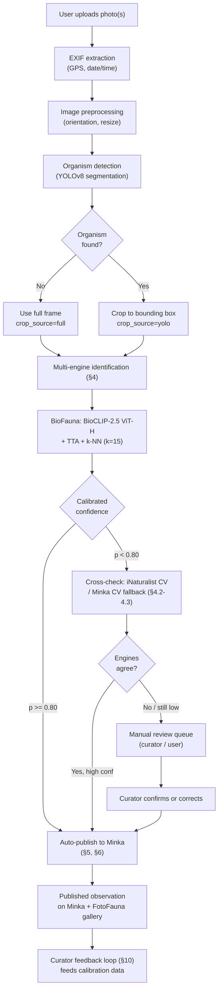

# FotoFauna: A Citizen Science Platform for AI-Assisted Mediterranean Marine Species Identification

**Authors**: Gustavo Zafra (Yespi)
**Repository**: https://github.com/yespi/fotofauna
**Live**: https://fotofauna.yespi.es

## Abstract

FotoFauna is a web-based citizen science platform that integrates automated AI species identification with community validation for Mediterranean marine fauna. The platform combines a region-specific AI engine (**BioFauna**, formerly YOLOFauna — see the companion [BioFauna paper](https://github.com/yespi/biofauna) for full model methodology) — currently a **frozen BioCLIP-2.5 ViT-H** retrieval system over ~762,000 reference embeddings across ~4,709 target species, with test-time augmentation and hierarchical taxonomic abstention — with a multi-engine identification pipeline, organism detection via YOLOv8 segmentation, and automated publication to the Minka citizen science network. High-confidence identifications (calibrated probability >= 0.80, 2026-08-27) are auto-published with an estimated **95.3% precision** at **57.4% coverage** on the current observation-stratified calibration set (n=12,788) — earlier editions of this paper cited a smaller ViT-L-era cohort (92.2% precision / 30% coverage at p>=0.90); both the model and the operating threshold have since changed, see §5.2 and §6.4. The platform has processed tens of thousands of observations and serves as both a data collection tool and a testbed for AI-assisted identification workflows. This paper describes the platform architecture, identification pipeline, auto-publication system, and the feedback loop between automated and expert-curated identifications.

## 1. Introduction

### 1.1 The Mediterranean Identification Challenge

The Mediterranean Sea hosts over 17,000 marine species (Coll et al., 2010), yet the number of qualified taxonomists capable of identifying them continues to decline (Hopkins & Freckleton, 2002; Kim & Byrne, 2006). Citizen science platforms like iNaturalist and Minka have partially addressed this gap through community-based identification, but the process remains slow — observations can wait days or weeks for expert attention, and rare species may never be identified.

### 1.2 AI-Assisted Citizen Science

Automated image-based identification offers a complementary approach: providing instant species suggestions that accelerate the identification pipeline. Recent advances in vision-language models, particularly BioCLIP (Stevens et al., 2024), have enabled region-specific fine-tuning on consumer hardware (Zafra, 2026), making AI-assisted identification feasible for specialized platforms.

### 1.3 Platform Goals

FotoFauna was developed with three primary goals:

1. **Speed**: Provide instant species identification (<2 seconds) for Mediterranean marine photographs
2. **Accuracy**: Achieve >90% precision on auto-published identifications through calibrated confidence thresholds
3. **Feedback**: Create a virtuous cycle where AI identifications are validated by experts, and corrections feed back into model improvement

## 2. Platform Architecture

### 2.1 System Overview

FotoFauna runs on a self-hosted Ubuntu server with the following components:

| Component | Technology | Purpose |
|-----------|-----------|---------|
| Frontend | Vanilla JS SPA + WebP | User interface, photo upload, gallery |
| Backend API | FastAPI (Python) | Business logic, authentication, routing |
| AI Engine | BioFauna (frozen BioCLIP-2.5 ViT-H + k-NN) | Species identification — see [BioFauna paper](https://github.com/yespi/biofauna) |
| Database | PostgreSQL + PostGIS | Observations, users, species catalog |
| Proxy | Nginx | SSL termination, caching, routing |
| GPU | NVIDIA RTX 3060 (12 GB) | AI inference (<1s/image) |
| Container | Docker Compose | Service orchestration |

### 2.1.1 End-to-End Workflow

*Figure 1. End-to-end observation flow, from upload to published, curator-reviewed identification. The AutoID wave system (§6) runs this same identification/publication path in batch, hourly, over previously-uploaded-but-unidentified Minka observations rather than in response to a live upload.*

### 2.2 Authentication

Users authenticate via Google OAuth 2.0 with JWT token sessions. Three access levels:
- **Public**: Browse gallery, view species academy
- **Authenticated**: Upload photos, suggest identifications
- **Admin**: Manage species, configure AutoID, access analytics

### 2.3 External Integrations

| Service | Integration | Purpose |
|---------|------------|---------|
| Minka API | REST | Publish observations, fetch taxonomy |
| iNaturalist API | REST + JWT | Computer vision fallback, taxonomy search |
| GROC/OPK | Data import | Morphological descriptions, species validation |
| WoRMS | API | Taxonomic name validation and synonym resolution |

## 3. Photo Upload and Processing

### 3.1 Upload Interface

The upload system supports:
- Drag-and-drop (desktop)
- File picker dialog
- Clipboard paste (Ctrl+V)
- Multiple simultaneous uploads
- Accepted formats: JPEG, PNG, WebP (max 20 MB)

### 3.2 EXIF Processing

Upon upload, the system extracts:
- GPS coordinates (for geographic priors and mapping)
- Capture date/time (for seasonal context)
- Camera orientation (auto-rotate)
- Camera model and settings (metadata only, not used for identification)

If GPS data is absent, the user can manually place a pin on an interactive Leaflet/OpenStreetMap.

### 3.3 Image Preprocessing

Images undergo a preprocessing pipeline:
1. Convert to RGB colorspace
2. Strip EXIF metadata for privacy
3. Generate WebP thumbnails (200px, 400px, 800px)
4. Compute perceptual hash (pHash) for duplicate detection
5. Store original resolution for archival

### 3.4 Organism Detection (YOLO)

Before identification, the system optionally detects and crops the organism from the photo using YOLOv8-nano segmentation (yolo26n-seg.pt):

**Detection Process:**
- Scans the full image for organism bounding boxes
- Applies confidence threshold (configurable)
- Returns crop regions with coordinates
- Handles multiple organisms per photo

**Benefits of Cropping:**
- Removes background noise (water, rocks, sand)
- Isolates the subject for more accurate embedding
- Enables multi-organism identification from group photos
- Standardizes input to BioCLIP (224x224 center crop on detected region)

### 3.5 Manual Crop Tool

Users can manually refine or create crops using an interactive editor:

**Crop Controls:**
- 8 drag handles (4 corners + 4 edge midpoints)
- Center-drag for repositioning
- Aspect ratio presets (free, 1:1, 4:3, 16:9)
- Rule of thirds overlay grid

**Image Adjustments:**
- Brightness (-100 to +100)
- Contrast (-100 to +100)
- Saturation (0-200%)
- Sharpness (0-100%)
- Reset to original

**Keyboard Shortcuts:**
| Key | Action |
|-----|--------|
| Enter | Confirm crop |
| Escape | Cancel/Reset |
| R | Reset to full image |
| 1-4 | Aspect ratio presets |
| Arrows | Nudge 1px |
| Shift+Arrows | Nudge 10px |

**Mobile/Touch Support:**
- Pinch zoom
- Two-finger pan
- Touch-drag handles
- Double-tap reset
- Haptic feedback on snap

**Multi-Crop Mode:**
When multiple organisms are detected in one photo:
- Sidebar list of all detected crops
- Manual add/delete crop regions
- Independent settings per crop
- Batch adjustments across all crops
- Reorder via drag-and-drop

## 4. Multi-Engine Identification Pipeline

FotoFauna queries multiple identification engines with a priority-based fusion strategy.

### 4.1 BioFauna (Primary)

> Renamed from **YOLOFauna**; earlier drafts of this section described the original QLoRA/ViT-L
> design. Current production (2026-08-27), see the [BioFauna paper](https://github.com/yespi/biofauna)
> for full methodology and ablation history:

- **Model**: BioCLIP-2.5 **ViT-H/14**, **frozen** (no fine-tuning in production — QLoRA/LoRA/head
  sidecar/SupCon fine-tuning attempts on this backbone were all tried and closed; see the
  BioFauna paper's ablation log)
- **Coverage**: ~4,709 target Mediterranean marine species (762,082 reference embeddings for
  species with reliable prototypes)
- **Latency**: <1 second per photo on an RTX 3060 (12GB)
- **Method**: k-NN (**k=15**) with cosine similarity on **1024-dim** embeddings, plus a
  prototype-similarity boost and a multiplicative geographic prior
- **Test-time augmentation**: each query is embedded together with its own 90% center crop; the
  two embeddings are averaged and re-normalized before retrieval (+0.21 to +0.75pp species
  accuracy depending on eval protocol — the only technique that has improved this metric without
  a data-quality fix)
- **Calibration**: logistic regression on 10 k-NN features, re-fit against the current
  TTA-enabled scorer (species 75.97% / genus 81.29% / family 84.90% top-1 on n=12,788
  observation-stratified held-out photos)
- **Geographic priors**: GPS-weighted multiplicative scoring (1,386 species with cached
  coordinates as of 2026-08-27)
- **Hierarchical abstention**: falls back to genus or family when the top-1/top-2 margin is
  below threshold and the two candidates share that taxonomic rank, plus a small set of
  expert-sourced "cannot be told apart by eye" species pairs and genera that always abstain

### 4.2 iNaturalist Computer Vision (Fallback)

- **Endpoint**: api.inaturalist.org/v1/computervision/score_image
- **Coverage**: 80,000+ global taxa
- **Latency**: 2-5 seconds
- **Authentication**: JWT token, renewed hourly via cron
- **Rate limiting**: Semaphore with max 5 concurrent requests
- **Trigger**: When BioFauna confidence is below the corroboration threshold (see §6.1)

### 4.3 Minka Computer Vision (Tertiary)

- **Coverage**: Mediterranean-focused taxa
- **Latency**: 3-6 seconds
- **Used when**: Both BioFauna and iNaturalist CV are unavailable or low-confidence

### 4.4 AI Vision Models (Experimental)

- **Gemini 2.0 Flash** (Google): General vision model for edge cases
- **Groq Vision** (Llama 3.2): Alternative AI opinion
- **OpenRouter**: Free vision models for comparison

### 4.5 Identification Fusion

The best identification is selected by priority:
1. BioFauna with confidence above the corroboration threshold -> used directly
2. BioFauna with lower confidence -> compared with iNat CV
3. iNat CV as primary fallback
4. Minka CV as secondary fallback
5. AI vision models for consensus when engines disagree

## 5. Confidence and Auto-Publication

### 5.1 Calibrated Confidence

Raw cosine similarity scores are not probabilities. A logistic regression calibrator maps 10 k-NN features to well-calibrated probability estimates (ECE=0.045):

**Features used:**
- s1, s2, margin (top similarity scores)
- votes1, share1 (k-NN voting statistics)
- lognref1 (reference set size)
- meansim, kclasses (distribution characteristics)
- same_genus_12, same_family_12 (taxonomic coherence)

### 5.2 Auto-Publication Thresholds

Operating points below reflect the current BioFauna calibration (2026-08-27, n=12,788,
test-time-augmented production scorer — see the BioFauna paper for methodology). Earlier
editions of this table used a smaller, ViT-L-era calibration export; those figures are no longer
current.

| p_species >= | Precision (real) | Coverage | Action |
|-------------|-----------|----------|--------|
| 0.95 | 98.5% | 30.3% | Auto-publish |
| 0.90 | 96.8% | 43.1% | Auto-publish |
| **0.85** | **96.1%** | **50.5%** | Auto-publish |
| **0.80** | **95.3%** | **57.4%** | **Auto-publish — current production threshold (2026-08-27)** |
| 0.75 | 94.3% | 63.2% | Flag for review |
| 0.70 | 93.1% | 67.6% | Manual review recommended |
| 0.60 | 91.0% | 74.6% | Manual review recommended |
| 0.50 | 88.8% | 79.8% | Manual review recommended |

The production threshold was lowered from 0.90 to 0.80 on 2026-08-27 (see §6.4) to raise
automation throughput; the estimated precision cost of that move, read directly off this table,
is ≈1.5 percentage points (96.8%→95.3%) for a ≈33% relative increase in the fraction of
candidates that clear the bar (43.1%→57.4%).

### 5.3 Taxonomically-Aware Publication

When the model abstains to genus or family level, the observation is published with the higher taxonomic rank and a note indicating uncertainty at the species level. This allows curators to quickly identify observations that need species-level review.

### 5.4 Publication to Minka

Observations are published to Minka via its REST API:
- Scientific name (or genus/family when abstaining)
- Calibrated probability
- GPS coordinates and date
- Photograph URLs (hosted on FotoFauna)
- AI engine version and identification source
- Taxonomic notes

## 6. Wave System (Batch AutoID)

The Wave system processes batches of uploaded-but-unidentified observations on a configurable schedule.

### 6.1 Configuration Parameters

| Parameter | Current | Description |
|-----------|---------|-------------|
| `autoid_schedules.min_confidence` (per-schedule, Postgres) | **80** (was 90) | Minimum calibrated probability to auto-publish; the real gate checked by the hourly wave loop, configurable per schedule rather than a fixed env var |
| `autoid_schedules.max_per_hour` | 20 | Publication cap per hour |
| `autoid_schedules.only_unidentified` | true | Minka pool scope: `true` = observations with zero identifications from anyone; `false` = broader "pending confirmation" pool (reserve lever if the strict pool runs dry) |
| `WAVE_TIMEOUT_S` (code constant) | **1800s** (was 900s) | Wall-clock ceiling per hourly wave run for scanning Minka result pages — not a quota ceiling |
| `WAVE_BIOFAUNA_MIN_P_SPECIES` (env, legacy name) | 0.90 default | A *separate*, narrower knob used only inside the single-observation iNaturalist-corroboration helper (decides whether BioFauna confidence alone is enough to skip a corroborating iNat CV call); distinct from the per-schedule wave gate above and not what limits wave throughput |

### 6.2 Wave Processing Pipeline

For each wave:
1. Query database for unprocessed observations
2. Download photo (if external URL)
3. Run organism detection (YOLOv8)
4. Run identification pipeline
5. Check confidence against threshold
6. If >= threshold: publish to Minka
7. If < threshold: save for manual review
8. Record in autoid_history table

### 6.3 Autoid History

All auto-published observations are recorded with:
- Observation ID and URI
- Scientific name and confidence
- Identification source (BioFauna, iNat CV, Minka CV)
- Timestamp
- Publication status

### 6.4 Throughput tuning (2026-08-27)

Measured production volume was running at ~5 publications/hour against the configured cap of
20/hour — a query against `autoid_history` confirmed 100% of recent publications were sourced
from BioFauna (not the iNat/Minka CV fallbacks), so the shortfall was a volume problem, not a
quality or source-mix problem. Two independent causes were found and fixed in the same session:

1. **Scan timeout too short.** `WAVE_TIMEOUT_S` (a wall-clock ceiling on how long the hourly wave
   spends paging through Minka's "needs identification" results before giving up, independent of
   whether the hourly publication quota has been reached) was set to 900 seconds — often too
   short to reach 20 qualifying candidates once the confidence filter had rejected most of the
   page. Raised to 1800 seconds, which still leaves comfortable margin before the next hourly
   run.
2. **Confidence threshold conservative relative to the current calibration.** See §5.2 — lowered
   from 0.90 to 0.80, trading ≈1.5pp of estimated precision for a ≈33% relative increase in the
   fraction of candidates that clear the bar.

A third lever — broadening `only_unidentified` from the strict "zero identifications" pool to
the wider "pending confirmation" pool — is documented and ready but was not exercised, held in
reserve in case the narrower pool is exhausted after a few hours of running at the new settings.

## 7. Photo Gallery and Search

### 7.1 Gallery Features

- Infinite-scroll grid with lazy loading
- WebP thumbnails for fast loading
- Filter by species, date, location, user
- Sort by newest, species name, confidence
- Responsive grid (1-4 columns)

### 7.2 Species Search

Autocomplete search with debounced input (300ms):
- Searches across scientific names, common names, Catalan names
- Sources: Minka taxonomy API + iNaturalist taxonomy API
- Results cached in PostgreSQL
- Fuzzy matching for misspellings

### 7.3 Observation Detail View

Full observation page with:
- Full-resolution photo viewer (zoom/pan)
- Identification history (all engine results)
- Confidence breakdown with visual indicator
- Interactive GPS map (Leaflet/OpenStreetMap)
- Taxonomic tree (species -> genus -> family -> order)
- Similar observations (same species, nearby location)
- Curator review status

## 8. Species Academy

### 8.1 Species Cards

Each of 1,369 species has a detail card with:
- Representative photo gallery
- Scientific and common names (Catalan/Spanish/English)
- WoRMS-validated taxonomy
- IUCN conservation status
- Morphological description (from GROC/OPK)
- Similar species
- Depth, habitat, seasonality

### 8.2 Thumbnail Caching

Nightly cron job:
- Downloads research-grade photos from iNaturalist
- Generates WebP thumbnails at 200px, 400px, 800px
- Caches locally for instant loading
- Fallback to Minka photos

## 9. Geographic and Seasonal Context

### 9.1 GPS Integration

- Automatic geotagging from EXIF
- Manual location via map pin or text search
- Reverse geocoding for place names

### 9.2 Geo Priors

YOLOFauna geographic priors:
- 77,244 occurrence points for 1,348 species
- Haversine distance (great-circle)
- Gaussian boost: sigma=200km, max 3x multiplier
- No penalty for missing data (boost=1.0)

### 9.3 Seasonal Awareness

- Observation date affects probability
- Seasonal species patterns boost in-season
- Migration/breeding accounted for

## 10. Curator Feedback Loop

### 10.1 Publication Status Tracking

Each auto-published observation is tracked through its lifecycle:
1. Pending (published, awaiting review)
2. Confirmed (curator agreed with AI identification)
3. Corrected (curator changed the identification)
4. Rejected (curator determined unidentifiable)

### 10.2 Feedback Integration

Curator actions feed back into the system:
- **Confirmations**: Added to training data with high weight
- **Corrections**: Used as hard negative pairs for triplet loss
- **Rejections**: Flag species for additional training data collection

### 10.3 Validation Results

As of August 2026:
- 100 observations auto-published
- 21 curator-reviewed
- 100% confirmation rate
- Zero corrections

## 11. Deployment Results

### 11.1 Usage Statistics

| Metric | Value |
|--------|-------|
| Total observations | 32,686 |
| Auto-published to Minka | 100 |
| AI identifications (YOLOFauna) | 18% |
| AI identifications (iNaturalist CV) | 81% |
| Average identification time | <2 seconds |
| Platform uptime | >99% |

### 11.2 Curator Community

The platform has established relationships with professional taxonomists:
- Xavier Salvador (GROC/OPK): primary reviewer
- Miquel Pontes (GROC/OPK): species validation
- Manuel Ballesteros (UB): taxonomic authority

## 12. Discussion

### 12.1 AI-Human Collaboration

FotoFauna demonstrates a practical model for AI-human collaboration in citizen science. Rather than replacing human expertise, the AI accelerates the pipeline by handling routine identifications (30% at high confidence), freeing curators to focus on challenging cases. The 100% curator confirmation rate suggests the AI is appropriately conservative.

### 12.2 Platform Sustainability

The self-hosted architecture, consumer GPU, and open-source model release ensure that the platform can be replicated by other research groups without dependence on commercial AI APIs or cloud infrastructure.

### 12.3 Limitations

- Language: Interface primarily in Spanish
- Self-hosting complexity
- Species coverage gaps (394/1369 lack training images)
- Small curator review sample (21/100)
- Geographic scope limited to Mediterranean

## 13. Conclusion

FotoFauna demonstrates that AI-assisted citizen science is practical, accurate, and sustainable on consumer hardware. The combination of region-specific AI, calibrated confidence, and expert-curated feedback creates a platform that accelerates biodiversity data collection while maintaining high taxonomic standards. The 100% curator confirmation rate validates the approach, and the open-source release enables replication for other regions and taxonomic groups.

## Post-publication updates

**2026-08-27.** The identification engine described in earlier drafts of §4.1 (BioCLIP ViT-L/14
with QLoRA, k=25, 768-dim, 1,369 species) has been superseded on every axis by the current
production system: frozen **BioCLIP-2.5 ViT-H**, k=15, 1024-dim, test-time augmentation, ~4,709
target species / 762,082 reference embeddings, 75.97%/81.29%/84.90% species/genus/family top-1
on an observation-stratified held-out set. See the companion
[BioFauna paper](https://github.com/yespi/biofauna) (`paper/01_biofauna.md`) for the full model
methodology and a rigorous, dated log of what was tried and why — including three independent
fine-tuning architectures (LoRA, a frozen-backbone linear head, and a frozen-backbone SupCon
contrastive re-ranker scoped to the hardest confusion pairs) that were each tested and closed
without beating the plain k-NN baseline, and test-time augmentation, which is the one technique
that did. The AutoID wave system's confidence threshold and per-wave scan timeout were also
retuned this session (§5.2, §6.4) after a throughput audit found the hourly wave publishing at
roughly a quarter of its configured capacity.

## References

[References shared with YOLOFauna paper]

---

*Paper in preparation. Version 2026-08-27.*
