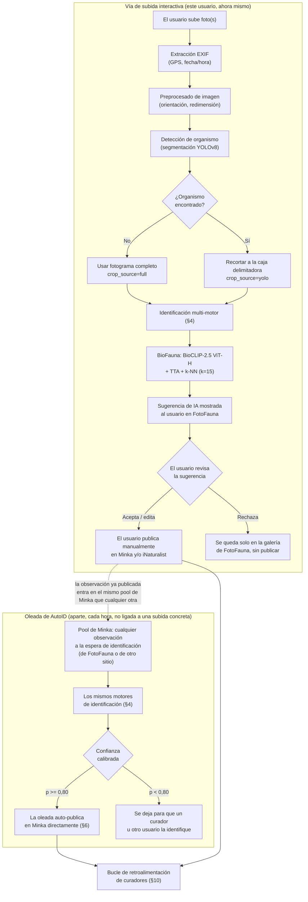
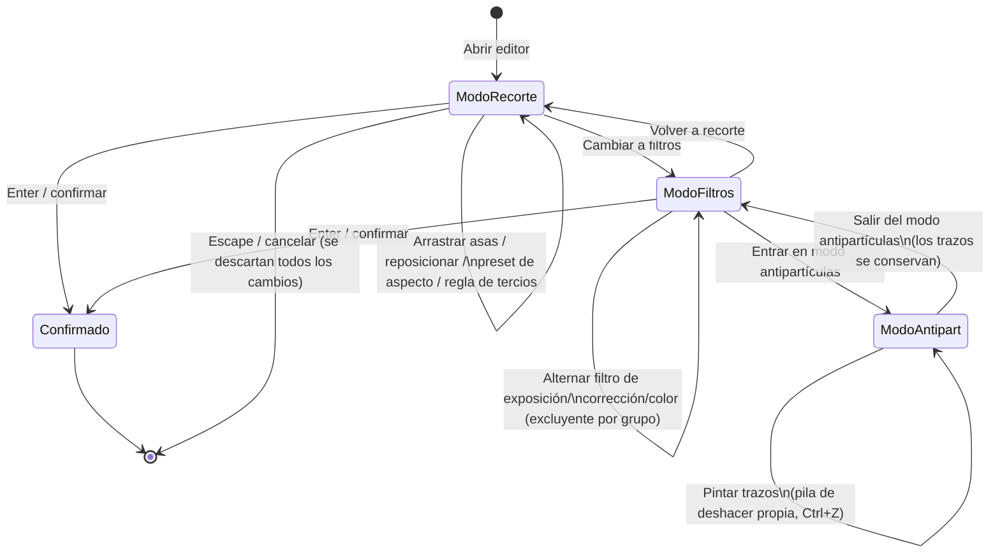
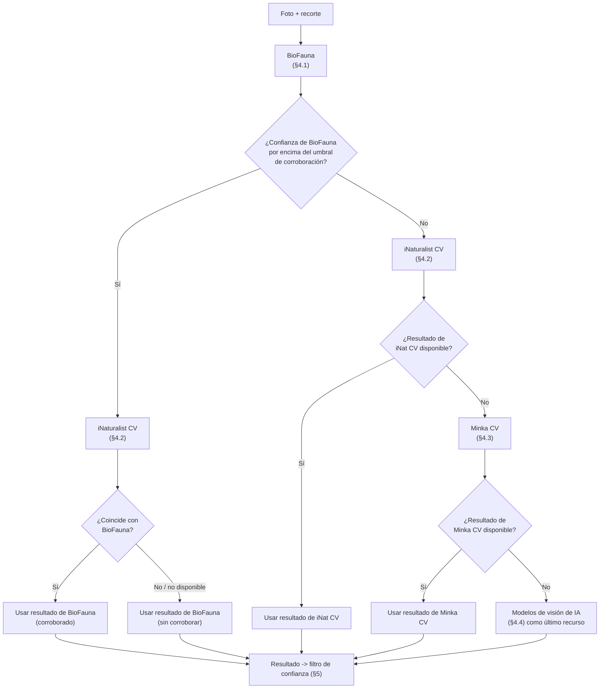
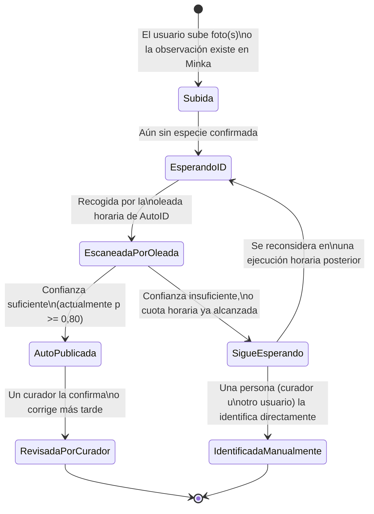
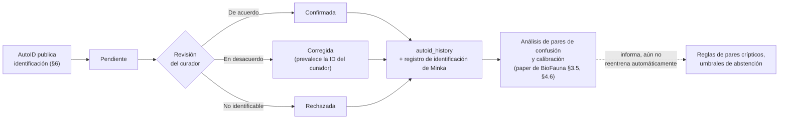

# FotoFauna: una plataforma de ciencia ciudadana para la identificación de especies marinas mediterráneas asistida por IA

**Autores**: Gustavo Zafra (Yespi)
**Repositorio**: https://github.com/yespi/fotofauna
**En vivo**: https://fotofauna.yespi.es

## Resumen

> **Nota editorial (12-sep-2026):** las cifras de calibración citadas en este paper (n=12.788,
> 27-ago-2026) son anteriores a una cosecha del rezago de evaluación y una campaña de calidad
> fotográfica en fanerógamas documentadas en el paper compañero de BioFauna, §4.18–§4.19
> (exactitud de especie actual **86,85%** out-of-sample sobre n=18.273; especies sin ninguna
> cobertura de evaluación reducidas de 1.267 a 64 de 2.989; *Posidonia oceanica* desplegada a
> producción). La tabla de precisión/cobertura de AutoID de más abajo (§5.2) aún no se ha
> recalculado contra la calibración actual y debe leerse como histórica hasta su refresco —
> ver `docs/STATUS.md` en el repo compañero para el estado operativo en vivo.

FotoFauna es una plataforma de ciencia ciudadana basada en web que integra la identificación automática de especies mediante IA con validación comunitaria para la fauna marina mediterránea. La plataforma combina un motor de IA específico de la región (**BioFauna** — ver el [paper compañero de BioFauna](https://github.com/yespi/biofauna) para la metodología completa del modelo), actualmente un sistema de recuperación **BioCLIP-2.5 ViT-H congelado** con aumento en tiempo de inferencia sobre 762.082 embeddings de referencia en 4.709 especies objetivo y abstención taxonómica jerárquica, con una tubería de identificación multi-motor, detección de organismo vía segmentación YOLOv8, y publicación automática en la red de ciencia ciudadana Minka. Las identificaciones de alta confianza (probabilidad calibrada ≥ 0,80) se auto-publican con una precisión estimada del **95,3%** con una **cobertura del 57,4%** sobre el conjunto de calibración actual estratificado por observación (n=12.788, §5.2). La plataforma ha procesado decenas de miles de observaciones y sirve tanto de herramienta de recolección de datos como de banco de pruebas para flujos de trabajo de identificación asistida por IA. Este paper describe la arquitectura de la plataforma, la tubería de identificación, el sistema de auto-publicación desde la perspectiva del usuario final, y el bucle de retroalimentación entre las identificaciones automáticas y las curadas por expertos; los detalles técnicos del modelo de identificación y del motor de programación de AutoID se cubren en profundidad en el paper compañero de BioFauna.

## 1. Introducción

### 1.1 El reto de la identificación mediterránea

El mar Mediterráneo alberga más de 17.000 especies marinas (Coll et al., 2010), y sin embargo el número de taxónomos cualificados capaces de identificarlas sigue disminuyendo (Hopkins & Freckleton, 2002; Kim & Byrne, 2006). Las plataformas de ciencia ciudadana como iNaturalist y Minka han abordado parcialmente esta brecha mediante identificación basada en la comunidad, pero el proceso sigue siendo lento — las observaciones pueden esperar días o semanas la atención de un experto, y las especies raras pueden no llegar a identificarse nunca.

### 1.2 Ciencia ciudadana asistida por IA

La identificación automática basada en imagen ofrece un enfoque complementario: proporcionar sugerencias instantáneas de especie que aceleran la tubería de identificación. Los avances recientes en modelos de visión-lenguaje, particularmente BioCLIP (Stevens et al., 2024), han hecho práctico un sistema de recuperación robusto, congelado y adaptado a la región sobre hardware de consumo (paper compañero de BioFauna), sin necesidad de ajustar finamente el propio backbone — un hallazgo empírico de ese trabajo compañero, no una suposición de este.

### 1.3 Objetivos de la plataforma

FotoFauna se desarrolló con tres objetivos principales:

1. **Velocidad**: proporcionar identificación instantánea de especie (<2 segundos) para fotografías marinas mediterráneas
2. **Precisión**: lograr alta precisión (actualmente ~95%, §5.2) en las identificaciones auto-publicadas mediante umbrales de confianza calibrados
3. **Retroalimentación**: crear un ciclo virtuoso donde las identificaciones de la IA se validan por expertos, y las correcciones retroalimentan la mejora del modelo

## 2. Arquitectura de la plataforma

### 2.1 Visión general del sistema

FotoFauna funciona en un servidor Ubuntu autoalojado con los siguientes componentes:

| Componente | Tecnología | Propósito |
|-----------|-----------|---------|
| Frontend | SPA en Vanilla JS + WebP | Interfaz de usuario, subida de fotos, galería |
| API backend | FastAPI (Python) | Lógica de negocio, autenticación, enrutado |
| Motor de IA | BioFauna (BioCLIP-2.5 ViT-H congelado + k-NN) | Identificación de especies — ver el [paper de BioFauna](https://github.com/yespi/biofauna) |
| Base de datos | PostgreSQL + PostGIS | Observaciones, usuarios, catálogo de especies |
| Proxy | Nginx | Terminación SSL, caché, enrutado |
| GPU | NVIDIA RTX 3060 (12 GB) | Inferencia de IA (<1s/imagen) |
| Contenedor | Docker Compose | Orquestación de servicios |

### 2.1.1 Flujo de trabajo de extremo a extremo

*Figura 1. Dos flujos distintos, que a menudo se confunden: (arriba) un usuario que sube una foto por FotoFauna recibe una **sugerencia** de IA y siempre publica en Minka/iNaturalist manualmente, él mismo — no hay auto-publicación en esta vía. (abajo) la oleada de AutoID (§6) es un proceso por lotes aparte, horario, que escanea el pool general de observaciones sin identificar de Minka — que puede incluir la de este mismo usuario, una vez publicada — y auto-publica una identificación en nombre del propietario de la observación solo cuando la confianza supera el umbral. Las dos comparten los mismos motores de identificación pero se disparan de forma distinta y ocurren en momentos distintos.*

### 2.2 Autenticación

Los usuarios se autentican vía Google OAuth 2.0 con sesiones de token JWT. Tres niveles de acceso:
- **Público**: explorar la galería, ver la academia de especies
- **Autenticado**: subir fotos, sugerir identificaciones
- **Admin**: gestionar especies, configurar AutoID, acceder a analíticas

### 2.3 Integraciones externas

| Servicio | Integración | Propósito |
|---------|------------|---------|
| API de Minka | REST | Publicar observaciones, obtener taxonomía |
| API de iNaturalist | REST + JWT | Fallback de visión por computador, búsqueda taxonómica |
| GROC/OPK | Importación de datos | Descripciones morfológicas, validación de especies |
| WoRMS | API | Validación de nombre taxonómico y resolución de sinónimos |

## 3. Subida y procesado de fotos

### 3.1 Interfaz de subida

El sistema de subida soporta:
- Arrastrar y soltar (escritorio)
- Diálogo selector de fichero
- Pegar desde portapapeles (Ctrl+V)
- Múltiples subidas simultáneas
- Formatos aceptados: JPEG, PNG, WebP (máx. 20 MB)

### 3.2 Procesado EXIF

Al subir, el sistema extrae:
- Coordenadas GPS (para priors geográficos y mapeo)
- Fecha/hora de captura (para contexto estacional)
- Orientación de la cámara (auto-rotación)
- Modelo de cámara y ajustes (solo metadatos, no se usan para identificación)

Si no hay datos de GPS, el usuario puede colocar manualmente un pin en un mapa interactivo Leaflet/OpenStreetMap.

### 3.3 Preprocesado de imagen

Las imágenes pasan por una tubería de preprocesado:
1. Convertir a espacio de color RGB
2. Eliminar metadatos EXIF por privacidad
3. Generar miniaturas WebP (200px, 400px, 800px)
4. Calcular hash perceptual (pHash) para detección de duplicados
5. Guardar la resolución original para archivo

### 3.4 Detección de organismo (YOLO)

Antes de la identificación, el sistema opcionalmente detecta y recorta el organismo de la foto usando segmentación YOLOv8-nano (yolo26n-seg.pt):

**Proceso de detección:**
- Escanea la imagen completa en busca de cajas delimitadoras de organismo
- Aplica un umbral de confianza (configurable)
- Devuelve regiones de recorte con coordenadas
- Maneja múltiples organismos por foto

**Beneficios del recorte:**
- Elimina ruido de fondo (agua, rocas, arena)
- Aísla el sujeto para un embedding más preciso
- Habilita la identificación multi-organismo a partir de fotos de grupo
- Estandariza la entrada a BioCLIP (recorte central 224x224 sobre la región detectada)

### 3.5 Herramienta manual de recorte

Los usuarios pueden refinar o crear recortes manualmente usando un editor interactivo:

**Controles de recorte:**
- 8 asas de arrastre (4 esquinas + 4 puntos medios de borde)
- Arrastre central para reposicionar
- Presets de relación de aspecto (libre, 1:1, 4:3, 16:9)
- Rejilla superpuesta de la regla de los tercios

**Filtros de visión asistidos por IA.** Más allá de los deslizadores manuales de brillo/contraste/saturación, el editor de recorte expone nueve filtros de procesado de visión en el servidor, agrupados por propósito, cada uno respaldado por su propio endpoint de procesado de imagen en vez de un simple desplazamiento de valores de píxel:

| Grupo | Filtro | Icono | Qué hace |
|-------|--------|------|--------------|
| Exposición | Auto (`enhance`) | ✨ | Balance automático de exposición/contraste/color con un solo clic |
| Exposición | Subexp. (`underexp`) | 🌙 | Recupera detalle en sombras sin quemar luces |
| Exposición | Sobreexp. (`overexp`) | ☀️ | Atenúa suavemente las luces quemadas |
| Exposición | Contraste (`contrast`) | ◑ | Estira el contraste con protección de luces |
| Corrección | Nitidez (`sharpen`) | 🔍 | Enfoque general |
| Corrección | Enfocar (`deblur`) | 🎯 | Recupera nitidez a partir de desenfoque por movimiento/enfoque sin cambiar el brillo o el contraste global |
| Corrección | Bruma (`dehaze`) | ☁️ | Elimina el velo azul/verde característico de la fotografía submarina sin alterar la exposición general |
| Color | Marina (`marine`) | 🌊 | Corrige la dominante de color típica de las fotos submarinas (pérdida de rojos/tonos cálidos con la profundidad) |
| Color | Rojos (`reds`) | 🔴 | Reduce los rojos sobresaturados (artefacto habitual de algunos flashes/filtros de corrección de color submarinos) |

Los filtros dentro del mismo grupo son mutuamente excluyentes (seleccionar uno deselecciona los demás de ese grupo); los filtros de grupos distintos se pueden combinar. Cada uno tiene una intensidad por defecto (0,5–1,0 en su propia escala interna) que el usuario puede ajustar o restablecer.

Cuando existe un recorte activo, los nueve filtros de servidor se aplican a ese **rectángulo** (no al fotograma completo); el resto de la foto permanece inalterado. Este es el caso de una cueva o de un sujeto en sombra: se recorta el organismo y el filtro analiza esa región.

Subexp. y Sobreexp. fijan la cantidad de corrección a partir del **histograma de luminancia de esa región** (mediana, colas, fracción recortada). El deslizador de intensidad es un multiplicador del usuario sobre esa cantidad automática (por defecto 90 %), no una corrección absoluta. Subexp. eleva solo la luminancia, preservando la cromaticidad (sin LIME por canal).

El filtro Marina recupera los rojos atenuados por la profundidad mediante un balance gray-world adaptativo: ganancias por canal acercan las medias de R, G y B a un objetivo común (verde y azul más conservadores que el rojo), seguido de CLAHE en luminancia y un unsharp suave. Desde agosto de 2026 la ganancia del canal rojo usa exponente `strength × 0,82` en lugar de `strength` completo, recortando el tinte salmón/magenta que la recuperación gray-world íntegra puede introducir en agua muy azul sin perder tonos cálidos naturales.

**Antipartículas (eliminación de partículas).** Una herramienta de pintado local aparte — no un filtro global — para eliminar nieve marina, motas de retrodispersión, y partículas flotantes de las fotos submarinas: el usuario pinta sobre las manchas no deseadas con un pincel ajustable, y cada trazo se procesa y se puede deshacer de forma independiente (su propia pila de deshacer, separada de la de la herramienta de recorte). Los cambios persisten al cambiar de filtro o al salir del editor a mitad de edición.

*Figura 2. Transiciones de modo del editor. Recorte, filtros, y el pincel de antipartículas son modos independientes dentro de la misma sesión de edición — cambiar de modo nunca descarta el trabajo ya hecho en otro modo, solo Escape/cancelar lo hace.*

**Atajos de teclado:**
| Tecla | Acción |
|-----|--------|
| Enter | Confirmar recorte |
| Escape | Cancelar/Restablecer |
| R | Restablecer a la imagen completa |
| 1-4 | Presets de relación de aspecto |
| Flechas | Ajuste de 1px |
| Shift+Flechas | Ajuste de 10px |

**Soporte móvil/táctil:**
- Zoom con pellizco
- Desplazamiento con dos dedos
- Asas de arrastre táctiles
- Doble toque para restablecer
- Retroalimentación háptica al ajustar

**Modo multi-recorte:**
Cuando se detectan varios organismos en una foto:
- Lista lateral de todos los recortes detectados
- Añadir/eliminar regiones de recorte manualmente
- Ajustes independientes por recorte
- Ajustes por lotes sobre todos los recortes
- Reordenar arrastrando y soltando

## 4. Tubería de identificación multi-motor

FotoFauna consulta múltiples motores de identificación con una estrategia de fusión basada en prioridad.

### 4.1 BioFauna (Principal)

BioFauna es el motor de identificación propio de FotoFauna (ver el [paper compañero de BioFauna](https://github.com/yespi/biofauna) para la metodología completa y su historial de ablaciones):

- **Modelo**: BioCLIP-2.5 **ViT-H/14**, **congelado** (sin ajuste fino en producción — los intentos de ajuste fino QLoRA/LoRA/cabeza sidecar/SupCon sobre este backbone se probaron todos y se cerraron; ver el registro de ablaciones del paper de BioFauna)
- **Cobertura**: ~4.709 especies marinas mediterráneas objetivo (762.082 embeddings de referencia para especies con prototipos fiables)
- **Latencia**: <1 segundo por foto en una RTX 3060 (12GB)
- **Método**: k-NN (**k=15**) con similitud coseno sobre embeddings de **1024 dim**, más un refuerzo por similitud a prototipo y un prior geográfico multiplicativo
- **Aumento en tiempo de inferencia**: cada consulta se embebe junto a su propio recorte central al 90%; los dos embeddings se promedian y renormalizan antes de la recuperación (+0,21 a +0,75pp de acierto de especie según el protocolo de evaluación — la única técnica que ha mejorado esta métrica sin un arreglo de calidad de datos)
- **Calibración**: regresión logística sobre 10 características de k-NN, reajustada contra el puntuador actual con TTA (especie 75,97% / género 81,29% / familia 84,90% top-1 sobre n=12.788 fotos reservadas estratificadas por observación)
- **Priors geográficos**: puntuación multiplicativa ponderada por GPS (1.386 especies con coordenadas en caché a fecha de 2026-08-27)
- **Abstención jerárquica**: retrocede a género o familia cuando el margen top-1/top-2 está por debajo del umbral y los dos candidatos comparten ese rango taxonómico, más un pequeño conjunto de pares de especies y géneros de fuente experta marcados como "no se pueden distinguir a simple vista" que siempre abstienen

### 4.2 Visión por computador de iNaturalist (Fallback)

- **Endpoint**: api.inaturalist.org/v1/computervision/score_image
- **Cobertura**: 80.000+ taxones globales
- **Latencia**: 2-5 segundos
- **Autenticación**: token JWT, renovado cada hora vía cron
- **Limitación de tasa**: semáforo con máximo 5 peticiones concurrentes
- **Disparador**: cuando la confianza de BioFauna está por debajo del umbral de corroboración (ver §6.1)

### 4.3 Visión por computador de Minka (Terciario)

- **Cobertura**: taxones con foco mediterráneo
- **Latencia**: 3-6 segundos
- **Se usa cuando**: tanto BioFauna como iNaturalist CV no están disponibles o tienen baja confianza

### 4.4 Modelos de visión de IA (Experimental)

- **Gemini 2.0 Flash** (Google): modelo de visión general para casos límite
- **Groq Vision** (Llama 3.2): opinión alternativa de IA
- **OpenRouter**: modelos de visión gratuitos para comparación

### 4.5 Fusión de identificación

La mejor identificación se selecciona por prioridad:
1. BioFauna con confianza por encima del umbral de corroboración -> se usa directamente
2. BioFauna con menor confianza -> se compara con iNat CV
3. iNat CV como fallback principal
4. Minka CV como fallback secundario
5. Modelos de visión de IA para consenso cuando los motores discrepan

*Figura 3. Prioridad de motores y lógica de fallback. BioFauna se intenta siempre primero; los otros tres motores solo se consultan como corroboración o fallback, en ese orden, nunca en paralelo salvo que la propia comprobación de confianza de BioFauna dispare una llamada de corroboración.*

## 5. Confianza y auto-publicación

### 5.1 Confianza calibrada

Las puntuaciones de similitud coseno en bruto no son probabilidades. Un calibrador de regresión logística mapea 10 características de k-NN a estimaciones de probabilidad bien calibradas (ECE=0,045):

**Características usadas:**
- s1, s2, margin (puntuaciones de similitud principales)
- votes1, share1 (estadísticas de voto de k-NN)
- lognref1 (tamaño del conjunto de referencia)
- meansim, kclasses (características de la distribución)
- same_genus_12, same_family_12 (coherencia taxonómica)

### 5.2 Umbrales de auto-publicación

Los puntos de operación de abajo reflejan la calibración actual de BioFauna (2026-08-27, n=12.788, puntuador de producción con aumento en tiempo de inferencia — ver el paper de BioFauna para la metodología).

| p_species >= | Precisión (real) | Cobertura | Acción |
|-------------|-----------|----------|--------|
| 0,95 | 98,5% | 30,3% | Auto-publicar |
| 0,90 | 96,8% | 43,1% | Auto-publicar |
| **0,85** | **96,1%** | **50,5%** | Auto-publicar |
| **0,80** | **95,3%** | **57,4%** | **Auto-publicar — umbral de producción actual (2026-08-27)** |
| 0,75 | 94,3% | 63,2% | Marcar para revisión |
| 0,70 | 93,1% | 67,6% | Revisión manual recomendada |
| 0,60 | 91,0% | 74,6% | Revisión manual recomendada |
| 0,50 | 88,8% | 79,8% | Revisión manual recomendada |

El umbral de producción se bajó de 0,90 a 0,80 el 2026-08-27 (ver §6.4) para elevar el rendimiento de automatización; el coste de precisión estimado de ese cambio, leído directamente de esta tabla, es de ≈1,5 puntos porcentuales (96,8%→95,3%) a cambio de un aumento relativo de ≈33% en la fracción de candidatos que superan el umbral (43,1%→57,4%).

### 5.3 Publicación consciente de la taxonomía

Cuando el modelo abstiene a nivel género o familia, la observación se publica con el rango taxonómico superior y una nota indicando incertidumbre a nivel especie. Esto permite a los curadores identificar rápidamente las observaciones que necesitan revisión a nivel especie.

### 5.4 Publicación en Minka

Las observaciones se publican en Minka vía su API REST:
- Nombre científico (o género/familia cuando abstiene)
- Probabilidad calibrada
- Coordenadas GPS y fecha
- URLs de las fotografías (alojadas en FotoFauna)
- Versión del motor de IA y fuente de identificación
- Notas taxonómicas

## 6. AutoID: la oleada de identificación automática, desde el lado del usuario

Esta sección describe AutoID tal como lo experimenta un **usuario** de FotoFauna o un **observador** de Minka. El motor de programación, la aritmética de confianza, y la configuración de base de datos detrás de él se cubren en profundidad en el [paper compañero de BioFauna](https://github.com/yespi/biofauna) (§4.3, Figura 4); esta sección se queda deliberadamente al nivel de "qué aparece en tu cuenta y por qué".

### 6.1 Qué ve el usuario

Un usuario no tiene que hacer nada para que AutoID actúe sobre sus observaciones: cualquier observación de Minka sin una identificación de especie confirmada es candidata, tanto si se subió por FotoFauna como directamente en Minka. Una vez por hora, un proceso en segundo plano examina un lote de esas observaciones y, para las que tiene confianza, publica una identificación — visible en Minka exactamente como si un curador u otro miembro de la comunidad la hubiera añadido, atribuida a la cuenta de la IA en vez de a una persona.

*Figura 4. Cómo se ve el estado de identificación de una observación desde fuera, independientemente de la mecánica interna de programación (paper de BioFauna, Figura 4). "SigueEsperando" no es un callejón sin salida — la misma observación se reconsidera en cada ejecución horaria posterior hasta que supera el umbral de confianza o una persona la identifica directamente.*

### 6.2 Señales visibles

- **Identificación auto-publicada**: aparece en la página de observación de Minka con un nombre científico, un porcentaje de confianza, y la cuenta de la IA como usuario identificador — funcionalmente idéntica a una identificación humana, y tan corregible como cualquier otra si está mal.
- **Identificación solo de especie o solo de género**: cuando el modelo no tiene suficiente confianza a nivel especie pero sí a un rango taxonómico superior (§ retroceso jerárquico, paper de BioFauna §3.5), la identificación publicada queda en ese rango superior en vez de arriesgar un nombre de especie.
- **Todavía sin acción**: una observación puede quedarse "esperando" más de un ciclo horario si la cuota de publicación horaria ya se llenó con otras observaciones, o si el pool de observaciones de Minka sin identificar actualmente es grande — esto es un artefacto de programación, no un rechazo.
- **Revisión de curador**: las identificaciones por debajo del umbral de confianza no se publican automáticamente; siguen visibles para los curadores (§10) como candidatas para revisión manual en vez de descartarse silenciosamente.

### 6.3 Historial de AutoID

Cada observación auto-publicada se registra con su ID y URI de observación, nombre científico y confianza, fuente de identificación (BioFauna, iNat CV, o Minka CV — §4), marca de tiempo, y estado de publicación. Este registro es lo que usan los curadores para auditar el historial de AutoID (§10) y contra lo que se puede comprobar directamente un reajuste de rendimiento (abajo), sin necesidad de instrumentar nada nuevo.

### 6.4 Manteniendo el ritmo con el volumen configurado (2026-08-27)

En un momento dado, el volumen de producción medido rondaba una cuarta parte del tope horario configurado, aunque prácticamente todas las publicaciones recientes venían de BioFauna directamente (no de los fallbacks de iNat/Minka CV) — es decir, el déficit era un problema de ritmo, no de calidad. Se encontraron y corrigieron el mismo día dos causas independientes y no relacionadas: la oleada se rendía escaneando candidatas nuevas demasiado pronto dentro de la hora, y el umbral de confianza estaba fijado más alto de lo que la curva de calibración actual realmente requería para un nivel de precisión comparable. Ambos arreglos se describen técnicamente en el paper de BioFauna (§4.3); desde el lado del usuario, el único efecto visible es que las observaciones antes estancadas ahora salen de la cola dentro de la hora en vez de quedarse "esperando" más tiempo.

## 7. Galería y búsqueda de fotos

### 7.1 Características de la galería

- Rejilla de scroll infinito con carga perezosa
- Miniaturas WebP para carga rápida
- Filtrar por especie, fecha, ubicación, usuario
- Ordenar por más reciente, nombre de especie, confianza
- Rejilla responsiva (1-4 columnas)

### 7.2 Búsqueda de especies

Búsqueda con autocompletado y entrada con debounce (300ms):
- Busca en nombres científicos, nombres comunes, nombres en catalán
- Fuentes: API de taxonomía de Minka + API de taxonomía de iNaturalist
- Resultados cacheados en PostgreSQL
- Coincidencia difusa para errores tipográficos

### 7.3 Vista de detalle de observación

Página de observación completa con:
- Visor de foto a resolución completa (zoom/desplazamiento)
- Historial de identificación (resultados de todos los motores)
- Desglose de confianza con indicador visual
- Mapa GPS interactivo (Leaflet/OpenStreetMap)
- Árbol taxonómico (especie -> género -> familia -> orden)
- Observaciones similares (misma especie, ubicación cercana)
- Estado de revisión del curador

## 8. Academia de Especies

### 8.1 Fichas de especie

Cada una de las ~4.709 especies objetivo tiene una ficha de detalle con:
- Galería de fotos representativas
- Nombres científico y comunes (catalán/español/inglés)
- Taxonomía validada por WoRMS
- Estado de conservación UICN
- Descripción morfológica (de GROC/OPK)
- Especies similares
- Profundidad, hábitat, estacionalidad

### 8.2 Caché de miniaturas

Trabajo cron nocturno:
- Descarga fotos de grado investigación desde iNaturalist
- Genera miniaturas WebP a 200px, 400px, 800px
- Cachea localmente para carga instantánea
- Fallback a fotos de Minka

## 9. Contexto geográfico y estacional

### 9.1 Integración GPS

- Geoetiquetado automático desde EXIF
- Ubicación manual vía pin en mapa o búsqueda de texto
- Geocodificación inversa para nombres de lugar

### 9.2 Priors geográficos

Los priors geográficos de BioFauna (detallados también en el paper compañero, §3.2.2, §4.6.2):
- 77.722 puntos de ocurrencia para 1.386 especies (a fecha de 2026-08-27; se amplían bajo demanda cuando una especie concreta resulta no tener ninguno, p. ej. para comprobar si dos especies visualmente similares son separables geográficamente)
- Distancia de Haversine (círculo máximo)
- Refuerzo gaussiano multiplicativo: sigma≈200km, multiplicador acotado
- Sin penalización por datos ausentes — una especie sin coordenadas en caché simplemente no recibe refuerzo, no uno negativo

### 9.3 Conciencia estacional

- La fecha de observación afecta a la probabilidad
- Los patrones estacionales de especies refuerzan dentro de temporada
- Se tiene en cuenta la migración/reproducción

## 10. Bucle de retroalimentación de curadores

### 10.1 Seguimiento del estado de publicación

Cada observación auto-publicada se sigue a lo largo de su ciclo de vida:
1. Pendiente (publicada, a la espera de revisión)
2. Confirmada (el curador estuvo de acuerdo con la identificación de la IA)
3. Corregida (el curador cambió la identificación)
4. Rechazada (el curador determinó que no es identificable)

*Figura 5. Bucle de retroalimentación de curadores tal como está implementado actualmente. La flecha discontinua marca una limitación real: las correcciones de curadores y el análisis de pares de confusión que sustentan actualmente informan actualizaciones manuales de las reglas de abstención y la calibración (paper de BioFauna, §3.5.5, §4.6) en vez de una tubería de reentrenamiento automático — cerrar ese bucle figura como trabajo futuro en ambos papers compañeros.*

### 10.2 Integración de la retroalimentación

Las acciones de los curadores se registran y se usan así:
- **Confirmaciones**: registradas en `autoid_history`; contribuyen a la cohorte de evaluación estratificada por observación usada en todo el paper de BioFauna.
- **Correcciones**: registradas con tanto la conjetura original de la IA como la corrección del curador; los pares de confusión acumulados de esto y de los datos de evaluación reservados son lo que alimenta las reglas de pares crípticos y de géneros de abstención fija descritas en el paper de BioFauna (§3.5.5) y el análisis de taxonomía de errores en su §4.6.
- **Rechazos**: marcan especies para recolección dirigida de fotos adicionales cuando el rechazo refleja escasez de datos genuina en vez de un sujeto no identificable (paper de BioFauna §3.1.3, §4.6.1).

Convertir esto en un bucle completamente automático y de reentrenamiento continuo explícitamente **aún no está hecho** — ver Limitaciones (§12.3) y las propias Limitaciones del paper de BioFauna (§5.4). El bucle actual es: registrarlo todo, analizar periódicamente, actualizar a mano las reglas de abstención y la calibración cuando el análisis lo respalda.

### 10.3 Resultados de validación

Una revisión temprana de curadores (una primera muestra de publicaciones de AutoID, anterior a la configuración actual de modelo y umbral) mostró una tasa de confirmación alta con la IA errando del lado conservador. Esa muestra concreta es anterior al modelo actual BioCLIP-2.5 ViT-H + TTA y al punto de operación p≥0,80 (§5.2, §6.4), así que no se repite aquí como cifra del estado actual; el registro continuo y no muestreado de correcciones de curadores contra la configuración actual figura como trabajo abierto (§12.3) en vez de reportarse como una medición terminada.

## 11. Resultados de despliegue

### 11.1 Estadísticas de uso

La plataforma ha procesado decenas de miles de observaciones desde su lanzamiento. La mezcla de fuente de identificación por motor y los recuentos de publicación actuales se rastrean en `autoid_history` (§6.3) y el panel de administración en vez de repetirse aquí como una instantánea fija, ya que — a diferencia de las cifras de acierto del modelo en todo este paper, que provienen de una cohorte de evaluación fija y reproducible fuera de línea (paper de BioFauna, §3.7) — los contadores de uso cambian continuamente y una cifra impresa en un borrador de paper queda desactualizada el mismo día. La latencia media de identificación está muy por debajo de 1 segundo por recorte en la GPU de producción (paper de BioFauna, §4.5).

### 11.2 Comunidad de curadores

La plataforma ha establecido relaciones con taxónomos profesionales:
- Xavier Salvador (GROC/OPK): revisor principal
- Miquel Pontes (GROC/OPK): validación de especies
- Manuel Ballesteros (UB): autoridad taxonómica

## 12. Discusión

### 12.1 Colaboración IA-humano

FotoFauna demuestra un modelo práctico de colaboración IA-humano en ciencia ciudadana. En vez de reemplazar la experiencia humana, la IA acelera la tubería manejando las identificaciones rutinarias con alta confianza (§5.2, §6) y dando a cada usuario que sube una foto una sugerencia instantánea incluso cuando no hay un curador disponible, liberando a los curadores para centrarse en los casos difíciles o disputados (§10).

### 12.2 Sostenibilidad de la plataforma

La arquitectura autoalojada, la GPU de consumo, y la publicación del modelo en código abierto aseguran que la plataforma pueda replicarse por otros grupos de investigación sin depender de APIs de IA comerciales o infraestructura en la nube.

### 12.3 Limitaciones

- Idioma: interfaz principalmente en español.
- Complejidad del autoalojamiento.
- Brechas de cobertura de especies: el catálogo rastrea explícitamente las especies por debajo del umbral de fotos de referencia fiables y puede dirigirse a ellas para descarga (paper de BioFauna, §3.1.1, §4.6.1), pero la cobertura sobre las ~4.709 especies objetivo sigue siendo desigual.
- El bucle de retroalimentación de curadores (§10) actualmente informa actualizaciones manuales de las reglas de abstención y la calibración en vez de cerrarse en una tubería de reentrenamiento automático — coincide con la limitación equivalente señalada en el paper de BioFauna (§5.4).
- Las estadísticas continuas de corrección de curadores contra la configuración actual de modelo y umbral aún no se publican como una métrica en vivo (§10.3); solo lo está una cohorte de evaluación fija fuera de línea (paper de BioFauna, §3.7).
- Alcance geográfico limitado al Mediterráneo; dentro de ese alcance, el prior geográfico no ayuda de forma relevante a los pares de confusión de mismo género más difíciles (paper de BioFauna, §4.6.2).

## 13. Conclusión

FotoFauna demuestra que la ciencia ciudadana asistida por IA es práctica y sostenible sobre hardware de consumo. La combinación de un motor de IA específico de la región (BioFauna — BioCLIP-2.5 ViT-H congelado, aumento en tiempo de inferencia, abstención jerárquica calibrada), una tubería de fallback multi-motor, una oleada horaria de AutoID para observaciones previamente sin identificar, y retroalimentación curada por expertos crea una plataforma que acelera la recolección de datos de biodiversidad manteniendo altos estándares taxonómicos. La publicación en código abierto tanto de esta plataforma como del paquete de modelo compañero de BioFauna permite la réplica para otras regiones y grupos taxonómicos.

## Referencias

[Referencias compartidas con el paper de YOLOFauna]

---

*Paper en preparación. Versión 2026-08-27. Traducción de la versión en inglés (`fotofauna_paper.md`), que es la referencia autorizada en caso de discrepancia.*
